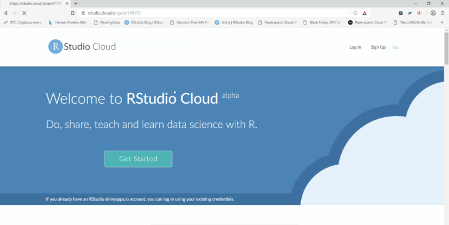
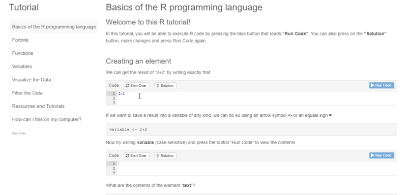
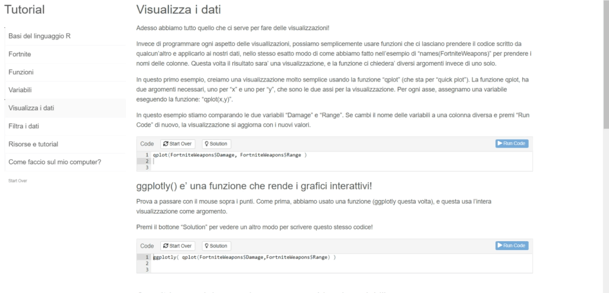

# [English Version](https://rstudio.cloud/project/179170)

[The english version of the tutorial is only working locally currently. Launch the application from the linked RStudio session (or use the link to the Italian one).](https://rstudio.cloud/project/179170)

This tutorial was made for my young italian cousins who don't have access to very good R resources, and was then translated to English to display as part of my work portfolio. I plan on making many more of these that go much more in-depth into topics.

# [Italian Version](https://predictcrypto.shinyapps.io/Tutorial/)

